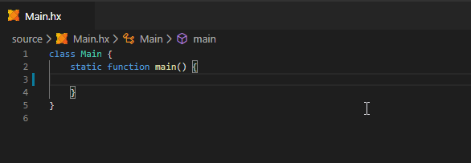
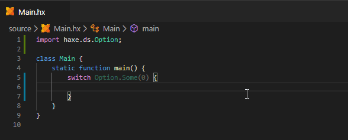
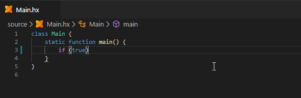
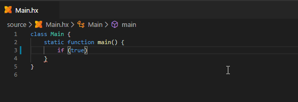

The Haxe extension extends VSCode's built-in auto indentation to support single line `if` / `else` / `for` / etc, as well as `case` and `default` in `switch`:





> **Note:** if these features are not working correctly for you, there may be a conflict with the [codedox](https://marketplace.visualstudio.com/items?itemName=wiggin77.codedox) extension. For now the workaround is to either disable the extension entirely or to disable its `"autoPrefixOnEnter"` setting. 

If you're using Allman style indentation with `{` in a new line, this may get in the way sometimes:



There are two ways to avoid this:

- Enable _extended indentation_ to automatically decrease the indent again when typing the `{`.

	```json
	"haxe.enableExtendedIndentation": true
	```
  
	


	> **Note:** due to the way this feature has to be implemented, this may introduce some typing overhead. This is the reason it's not enabled by default.

- Disable the Haxe extension's indentation rules - this may be preferable if you don't use bracketless `if` / `else` etc. However, you also lose auto indentation for `case` and `default`.

	```json
	"[haxe]": {
		"editor.autoIndent": "brackets"
	}
	```

You can also use [auto-formatting](https://github.com/vshaxe/vshaxe/wiki/Formatting) to automatically adjust the indentation of the entire file.