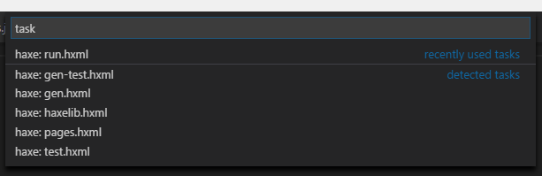
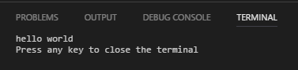
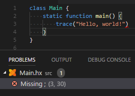

Vshaxe auto-discovers `.hxml` files in the root directory of your project and generates build tasks for them. You can access them with `Tasks` -> `Run Build Task` or by pressing <kbd>Ctrl</kbd>+<kbd>Shift</kbd>+<kbd>B</kbd>:



>**Note:** auto-generated tasks use the Haxe executable defined by the [`"haxe.executable"` setting](/vshaxe/vshaxe/wiki/Configuration).

Output of tasks is printed to the Terminal:



Compiler errors that occur during task execution are picked up by the "Problems" panel. You can click on them to go to the error's position:



You can also manually define tasks for `.hxml` files in a `.vscode/tasks.json` file, for instance for `.hxml` files that are in subdirectories:

```json
{
    "version": "2.0.0",
    "tasks": [
        {
            "command": "haxe",
            "args": ["build/build-js.hxml"],
            "problemMatcher": "$haxe"
        }
    ]
}
```

>**Known issues:** Haxe sometimes outputs relative and sometimes absolute paths, but the problem matcher can only be configured to accept one at a time ([#23](https://github.com/vshaxe/vshaxe/issues/23)).

For further information on the `tasks.json` format, please refer to the [official VSCode documentation](https://code.visualstudio.com/docs/editor/tasks). A section that should be particularly interesting for usage with Haxe is the ability to define [multiple tasks](https://code.visualstudio.com/docs/editor/tasks#_command-and-tasks) (think multiple targets).