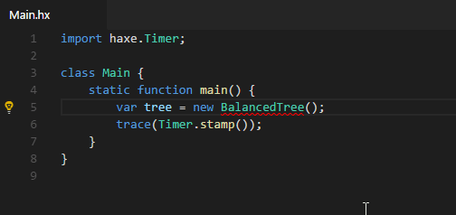
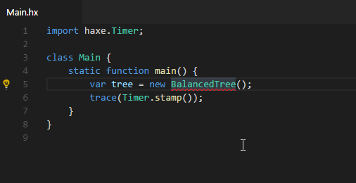
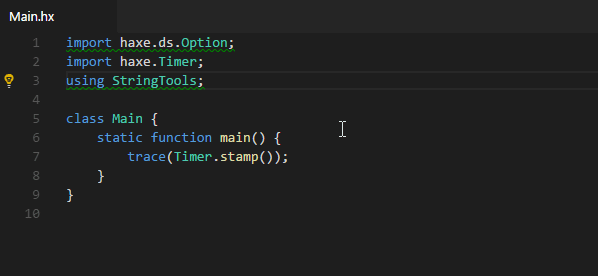
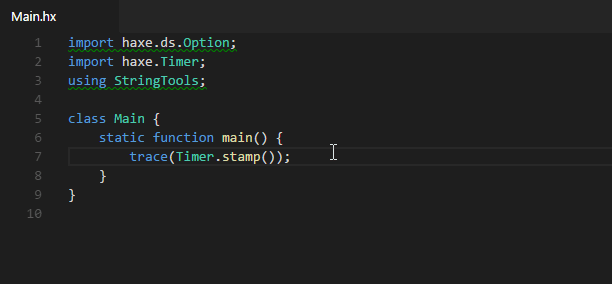
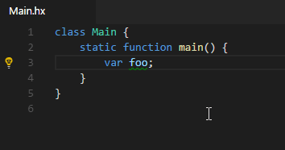
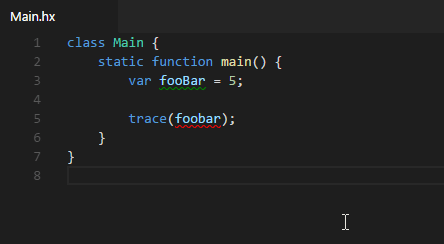

When a Code Action is available for the current selection / cursor position, this is indicated by a light bulb to the left of the editor:

To show the available actions, either click the light bulb or press <kbd>Ctrl</kbd>+<kbd>.</kbd>. This will open a popup menu:

In case you want to change the default shortcut, the `command` for this keybinding is `"editor.action.quickFix"`.

In the following sections, we will showcase all Code Actions that are associated with [Diagnostics](/vshaxe/vshaxe/wiki/Diagnostics). There are also some Code Actions for [Code Generation](/vshaxe/vshaxe/wiki/Code-Generation), please refer to that page for details on those.

### Import actions

There are several code actions to deal with importing unknown identifiers:

#### Add import

#### Change to fully qualified type

### Actions for unused code

There are several code actions that deal with removing unused code:

#### Remove unused import/using

#### Remove all unused imports/usings

#### Remove unused variable

#### Compiler error actions

In some cases, simple compiler errors can be fixed via a Code Action:

#### Invalid package

#### Typo suggestions

