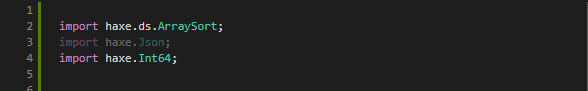

When a Code Action is available for the current selection / cursor position, this is indicated by a light bulb to the left of the editor:


To show the available actions, either click the light bulb or press <kbd>Ctrl</kbd>+<kbd>.</kbd>. This will open a popup menu:


In case you want to change the default shortcut, the `command` for this keybinding is `"editor.action.quickFix"`.

Additionally, there's also an "Auto Fix" command (`"editor.action.autoFix"`) that directly applies the "preferred" code action if one exists (usually the first one), without opening a menu. The default shortcut is <kbd>Shift</kbd>+<kbd>Alt</kbd>+<kbd>.</kbd>.

Here is an overview over all Code Actions that currently exist:

### Imports

#### Add import


#### Change to fully qualified type


### Unused Code

#### Remove unused import/using


#### Remove all unused imports/usings


#### Remove unused variable


### Compiler Errors

In some cases, simple compiler errors can be fixed with a Code Action:

#### Invalid package


#### Typo suggestions


#### Missing override keyword


### Refactorings

#### Extract var to enclosing scope


#### Add type hint


#### Invert if


#### Extract constant

Replaces all occurrences of a string literal with a constant.


#### Update to null operators


### Source Actions

Source Actions are special code actions that apply to the whole document, so they are not available contextually. You can select "Source Action..." from the context menu anywhere in the document to get a complete list:


#### Sort imports/usings

Sorts imports and usings in a module alphabetically.



#### Organize imports/usings

Combination of "Sort imports/usings" and "Remove all unused imports/usings".


VSCode also has a built-in "Organize Imports" command that is availbale from the command palette or with its default shortcut <kbd>Shift</kbd>+<kbd>Alt</kbd>+<kbd>O</kbd>.

### Configuration

- `"editor.codeActionsOnSave"` - All Source Actions can be applied on save.

	To enable autofixes on file save for basic compiler errors ([Fix All command](https://github.com/vshaxe/vshaxe/wiki/Commands#haxe-fix-all)), you can use the following:
	```json
	"editor.codeActionsOnSave": {
		"source.fixAll": true
	}
	```

	To organize imports on save, you can use the following:

	```json
	"editor.codeActionsOnSave": {
		"source.organizeImports": true
	}
	```

	Or if you only want to sort the imports without removing unused ones:

	```json
	"editor.codeActionsOnSave": {
		"source.sortImports": true
	}
	```

	Note: this works well together with [format on save](https://github.com/vshaxe/vshaxe/wiki/Formatting).
