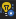
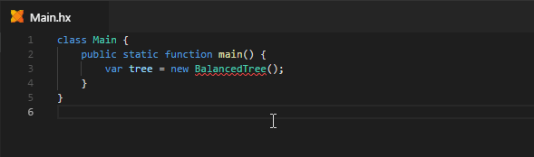

When a Code Action is available for the current selection / cursor position, this is indicated by a light bulb to the left of the editor:



To show the available actions, either click the light bulb or press <kbd>Ctrl</kbd>+<kbd>.</kbd>. This will open a popup menu:


In case you want to change the default shortcut, the `command` for this keybinding is `"editor.action.quickFix"`.

Here is an overview over all Code Actions that currently exist:

### Imports

#### Add import



#### Change to fully qualified type


### Unused Code

#### Remove unused import/using


#### Remove all unused imports/usings


#### Remove unused variable


### Compiler Errors

In some cases, simple compiler errors can be fixed with a Code Action:

#### Invalid package


#### Typo suggestions


### Configuration

- `"editor.codeActionsOnSave"` - Code Actions to be applied when the file is saved. This can be used to trigger the [Remove all unused imports/usings](#remove-all-unused-importsusings) code action on save:
    
	```json
    "editor.codeActionsOnSave": {
        "source.organizeImports": true
	}
	```
