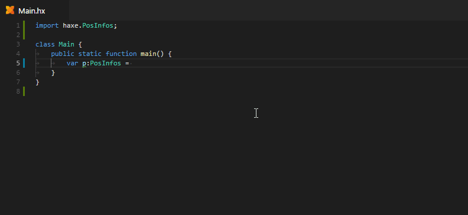
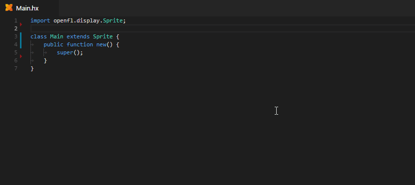
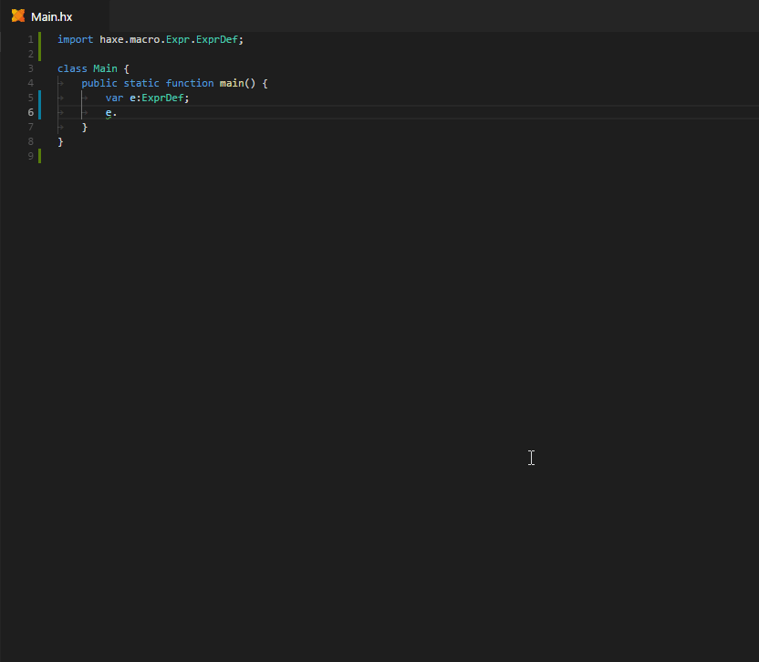
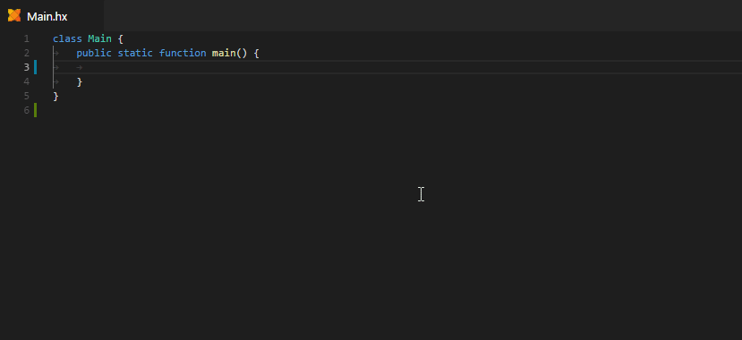
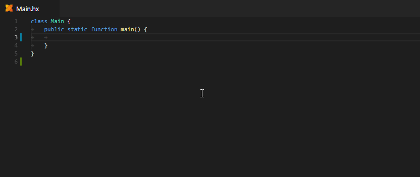
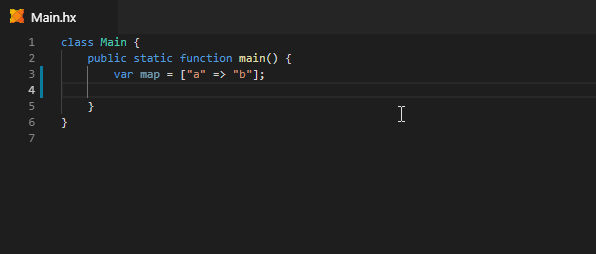
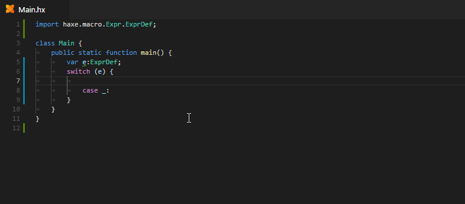

> **Note:** the Code Generation features on this page all require Haxe 4.0.0-preview.4 or newer.

### Auto-Imports

Whenever you select an unimported type from completion, an import is added to the top of the file automatically:


If you'd prefer the fully qualified path to be inserted instead, you can disable auto-imports like this:

```json
"haxe.codeGeneration": {
   "imports": {
       "enableAutoImports": false
   }
}
```

### Expected Type Completion

Expected type completion can be used in places where a certain type is expected. Use the regular completion shortcut (<kbd>Ctrl</kbd>+<kbd>Space</kbd>) to trigger it.

#### Object Literals

For generating object literals, there are two choices: generate an object literal with all fields, or just the ones that are required / non-optional.



#### Functions

Expected type completion can also be used in places where a function type is expected:


### Override Completion

After typing the `override` keyword, you are offered a list of functions you can currently override. Selecting one of them will generate the code for it, complete with imports.



### Postfix Completion

Postfix completion is triggered when "dot-completing" on identifiers with a certain type.

#### Switch-Case

For enums or enum abstracts, Postfix Completion allows generating a complete `switch` expression:



#### For-Each Loop

If a type has an [Iterator](https://haxe.org/manual/lf-iterators.html), a for loop can be generated for it:



#### Indexed For Loop

Indexed for loop generation is available on integers or types with fields named `length` / `count` / `size`:



#### For Key => Value

For any type that has a `keyValueIterator()`, such as `haxe.ds.Map` and `haxe.ds.List`, you can generate a `key => value` loop:



### Pattern Completion

When selecting an enum constructor from completion inside a pattern (after a `case` in a `switch`), capture variables for the arguments are auto-inserted:



### Configuration

There's a number of ways to customize how generated functions should look like. The following are the default settings, which apply to both [Expected Type Completion](#expected-type-completion) and [Override Completion](#override-completion).

```json
"haxe.codeGeneration": {
    "functions": {
        "anonymous": {
            "argumentTypeHints": false,
            "explicitNull": false,
            "returnTypeHint": "non-void",
            "useArrowSyntax": true
        },
        "field": {
            "argumentTypeHints": true,
            "explicitNull": false,
            "explicitPrivate": false,
            "explicitPublic": false,
            "placeOpenBraceOnNewLine": false,
            "returnTypeHint": "always"
        }
    }
}
```
