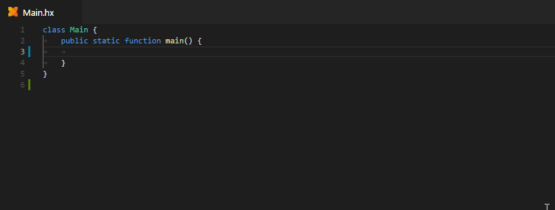

> **Note:** the Code Generation features on this page all require Haxe 4.0.0-preview.4 or newer. For earlier versions, only some very basic Code Generation based on Code Actions was available.

### Auto-Imports

Whenever you select an unimported type from completion, an import is added to the top of the file automatically:



If you'd prefer the fully qualified path to be inserted instead, you can disable auto-imports like this:

```json
"haxe.codeGeneration": {
   "imports": {
       "enableAutoImports": false
   }
}
```

### Expected Type Completion

### Override Completion

### Postfix Completion

### Pattern Completion

