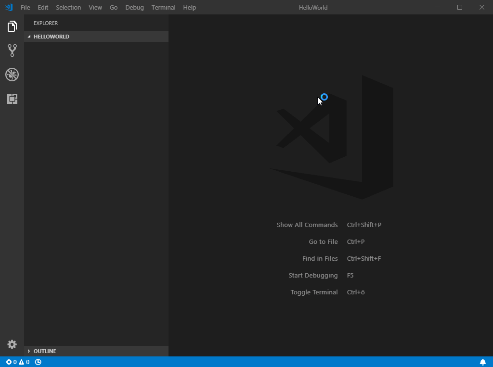
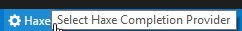

The vshaxe extension adds the following commands. You can invoke them by pressing <kbd>F1</kbd> or <kbd>Ctrl</kbd>+<kbd>Shift</kbd>+<kbd>P</kbd>/<kbd>Cmd</kbd>+<kbd>Shift</kbd>+<kbd>P</kbd> and
typing part of the command name. All commands are prefixed with `Haxe`:

### Haxe: Initialize VS Code Project

Scaffolds a very basic Haxe project in an empty workspace.



### Haxe: Restart Language Server

Restarts the language server and the Haxe completion server. Use it if anything goes wrong or to reload haxe-languageserver's code
after recompiling it.

### Haxe: Select Completion Provider

Selects the "provider" to use for completion. vshaxe has an extension API that allows another extension to provide the arguments for completion. Currently this is only used by the [Lime](https://marketplace.visualstudio.com/items?itemName=openfl.lime-vscode-extension) extension.

The built-in "Haxe" provider is available whenever there are `.hxml` files in the project's root directory or if [`"haxe.configurations"`](/vshaxe/vshaxe/wiki/Configuration) has been set.


Instead of using the command to open the dropdown, you can also click the Completion Provider item in the lower left of the status bar:



### Haxe: Select Configuration

Choose the currently active configuration (see [Configuration](https://github.com/vshaxe/vshaxe/wiki/Configuration#configurations-and-display-server) section for more info).


Instead of using the command to open the dropdown, you can also click the Haxe Configuration item in the lower left of the status bar:


### Haxe: Debug Selected Configuration

This command lets you debug the currently selected configuration, assuming there is a launch configuration with a matching name defined in `launch.json`. If you want, you can even override the default shortcut for starting a debug session (<kbd>F5</kbd>) in Haxe projects:

```json
{
	"key": "f5",
	"command": "haxe.debugSelectedConfiguration",
	"when": "vshaxeActivated"
}
```

Effectively, this means that the [`Haxe: Select Configuration` command](#haxe-select-configuration) offers a unified way to switch the target used for:

- code completion
- the default build task
- debugging

### Haxe: Run Global Diagnostics Check

Runs [Diagnostics](/vshaxe/vshaxe/wiki/Diagnostics) on all files in the workspace and displays them in the Problems view.

### Haxe: Toggle Code Lens

En/disables Haxe [Code Lens](/vshaxe/vshaxe/wiki/Code-Lens) in your [Configuration](/vshaxe/vshaxe/wiki/Configuration) by flipping the `"haxe.enableCodeLens"` setting.


### Haxe: Fix All


This command fixes simple compiler errors with obvious solutions:
- Adds missing semicolons and commas
- Removes wrong semicolons in objects (`{foo: 1;}`)
- Adds or removes wrong `override` modifier
- Removes `public / static` from module-level fields
- Fixes invalid package error
- Changes `final var` to `final`

To enable autofixes on file save for basic compiler errors, you can add the following to `.vscode/settings.json`:
```json
"editor.codeActionsOnSave": {
	"source.fixAll": true
}
```