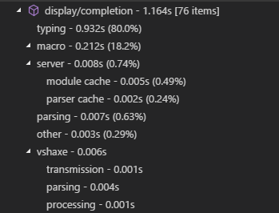
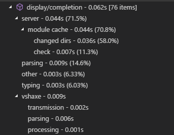

For completion to still peform well in medium to large projects, vshaxe relies on a "Completion Cache". To create this cache, it builds your project through the Haxe display server once on startup (with the display arguments and `--no-output`). This is also the reason for the slight delay until completion features are available initially.

Note that the cache not only impacts the speed of [Completion](/vshaxe/vshaxe/wiki/Completion) itself, but also practically almost every other feature the Haxe Language Server provides as well, since they all rely on various [Compiler Services](https://haxe.org/manual/cr-completion.html).

### How to tell if the completion cache works?

If vshaxe was unable to build a cache, you should receive a notification like this:

"Show Error" takes you to the Haxe output channel and the full error message:

For instance in this case, our `Main.hx` is missing an import for `haxe.Json`. After fixing the error, you can use the [Restart Language Server](https://github.com/vshaxe/vshaxe/wiki/Commands#haxe-restart-language-server) command to trigger antoher cache build.

### How big is the impact?

To illustrate the kind of difference the Completion Cache can make, here's a before / after of field completion in an (empty) HaxeFlixel project.

**Before:**

**After:**

Needless to say, a completion request taking over a second doesn't feel very snappy. 62 ms on the other hand are quite acceptable. 

### Why is a "real" build needed for caching?

When processing display requests (completion, goto definition, hover...), the compiler is in "display mode" and takes some shortcuts to be as fast as possible. Since no full build is performed, the results can't safely be cached and have to be discarded again.

If there is no cache for the compiler to rely on during these requests, the same processing has to be done over and over again from scratch each time. This usually leads to inacceptable completion performance, which is why vshaxe tries to build a cache.

### Configuration

- `"haxe.buildCompletionCache"` - Whether a completion cache should be built on startup. Defaults to `true`.
