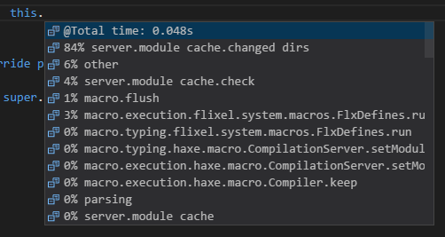

For completion to still peform decently in medium to large projects, vshaxe relies on a "Completion Cache". To create this cache, it builds your project through the Haxe display server once on startup (with the display arguments and `--no-output`). This is also the reason for the slight delay until completion features are available initially.

Note that the cache not only impacts the speed of [Completion](/vshaxe/vshaxe/wiki/Completion) itself, but also practically almost every other feature the Haxe Language Server provides as well, since they all rely on various [Compiler Services](https://haxe.org/manual/cr-completion.html).

### How to tell if the completion cache works?

If vshaxe was unable to build a cache, you should receive a notification like this:


"Show Error" takes you to the Haxe output channel and the full error message:


For instance in this case, our `Main.hx` is missing an import for `haxe.Json`. After fixing the error, you can use the [Restart Language Server](https://github.com/vshaxe/vshaxe/wiki/Commands#haxe-restart-language-server) command to trigger antoher cache build.

### How big is the impact?

To illustrate the kind of difference the Completion Cache can make, here's a before / after of field completion in an (empty) HaxeFlixel project (using [--times completion](/vshaxe/vshaxe/wiki/Completion#--times-completion)).

**Before:**


**After:**


Needless to say, a completion request taking well over half a second severely impacts any kind of flow you might otherwise achieve while programming. With under 100 ms however, it feels quite responsive.

### Can I make completion even faster?

There are ways to further decrease completion times using the [haxe.macro.CompilationServer](http://api.haxe.org/haxe/macro/CompilationServer.html?#setModuleCheckPolicy) API introduced in Haxe 3.4.0. By disabling shadowing and dependency checks for Flixel's dependencies in the `.hxml` used for completion, we can get field completion times <span>< 50 ms<span>:

```
--macro server.setModuleCheckPolicy(['flixel', 'openfl', 'lime', 'flash'], [NoCheckShadowing, NoCheckDependencies], true)
```



Apart from that, try adding `--times` and `-D macro-times` to your display `.hxml`. Maybe a lot of time is spent on a particular macro that doesn't need to do _quite_ as much work in display mode as in a regular compilation (check for `#if display`).

### How do I disable it?

Add this to your settings to disable completion caching entirely (for instance if your `.hxml` file is only suitable for display requests, but not builds):

```
"haxe.buildCompletionCache": false
```

### Why is a "real" build needed for caching?

The Completion Sever can't cache any results during regular display requests (e.g. "show me the fields for this identifier"). In display mode, the compiler relies on some tricks and simplifications to return as quickly as possible. Unfortunately, this also means that results are not useful for caching and have to be thrown away again.

However, with many display requests, this quickly adds up to a lot of redundant work, and overall _worse_ performance compared to taking the time to build a proper cache once on startup.