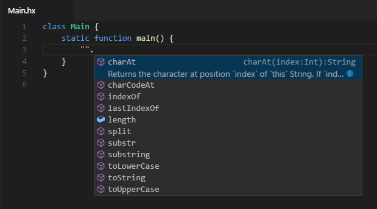
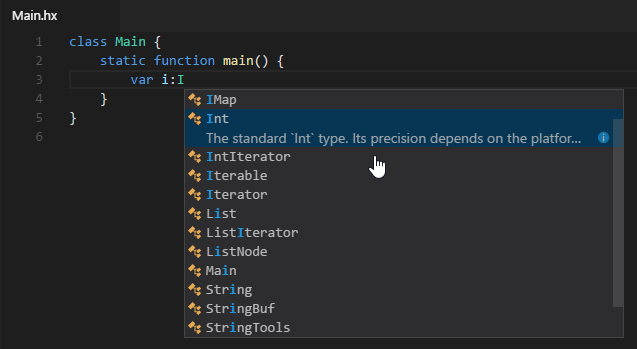
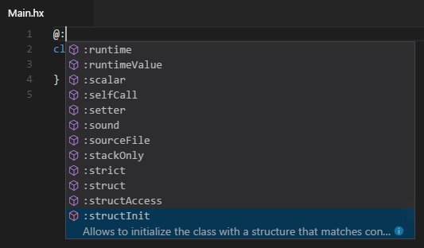

### Field Completion

The simplest and most commonly used form of completion is field / "dot" completion. It is invoked whenever a dot is typed after an identifier to show the available variables, properties and methods for it:

### Toplevel Completion

Toplevel completion gets its name from showing you the available "top level" identifiers, such as imported types or enum values. It can be invoked manually using <kbd>Ctrl</kbd>+<kbd>Space</kbd> anywhere in the document:

### Type Hint Completion

Completion is triggered automatically when typing the `:` in a type hint, showing the available types:

### Compiler Metadata Completion

Whenever `@:` is typed, a list of [compiler metadata](https://haxe.org/manual/cr-metadata.html) is presented to you:

