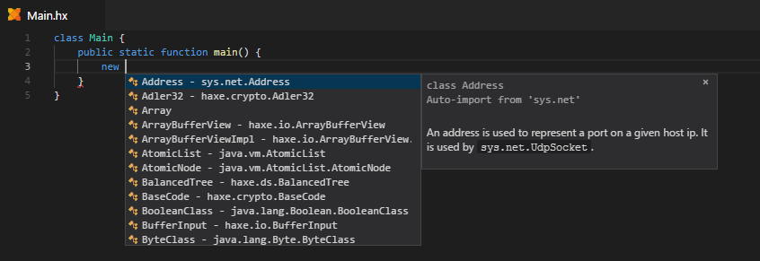

Completion is triggered automatically when typing certain trigger characters. It can also be invoked manually with <kbd>Ctrl</kbd>+<kbd>Space</kbd>. What "completion mode" is triggered depends on the context:

### Field Completion

The simplest and most commonly used form of completion is field / "dot" completion. It is invoked whenever a dot is typed after an identifier to show the available variables, properties and methods for it:

### Toplevel Completion

Toplevel completion gets its name from showing you the available "top level" identifiers, such as imported types or enum values. It usually needs to be triggered manually.

### Structure Field Completion

When invoking completion with <kbd>Ctrl</kbd>+<kbd>Space</kbd> in an object literal, the fields for the current structure type will be listed:

### Type Hint Completion

Completion is triggered automatically when typing the `:` in a type hint, showing the available types:

### New Completion

After typing `new`, completion pops up automatically and is filtered by types that have a constructor:

### Extends and Implements Completion

Similar to New Completion, the completion list after `extends` / `implements` is filtered appropriately to only list types that can be extended / implemented:

### Compiler Metadata Completion

When typing `@`, the available [compiler metadata](https://haxe.org/manual/cr-metadata.html) is listed:

