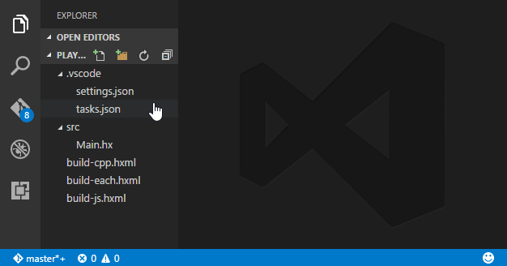

The vshaxe extension supports the following settings. They can be configured in user or workspace settings file (`.vscode/settings.json`):

### Display Configurations and Display Server

```js
{
    "haxe.displayConfigurations": [ // one or more configurations for the haxe completion server
        ["-cp", "src", "-js", "main.js"], // a configuration is array of arguments passed to the completion server
        ["build.hxml"], // hxml file is an normal haxe argument too
    ],
    "haxe.displayServer": { // configuration for starting haxe completion server itself
        "arguments": ["-v"], // arguments before --wait (-v is useful for debugging)
    }
}
```

Beware that display configurations specified in `"haxe.displayConfigurations"` should only contain arguments suitable for
completion, such as `-cp`, `-lib`, `-D` and target output (`-js`, `-cpp`, etc.). This is particularly important when
specifying an `.hxml` file for completion: make sure it doesn't contain `-cmd`, `--next`, `--each` and other arguments
not suitable for completion.

#### Multiple Display Configurations

Multiple display configurations are useful when working with a codebase that is meant
to be compiled for different Haxe targets, or with a different set of defines. If
there is more than one configuration provided in the `"haxe.displayConfigurations"` setting,
when a `.hx` file is open, a selection appears in the status bar allowing to switch current
display configuration:



The same menu can also be shown by using `Haxe: Select Configuration` command from the command palette or a keybinding.

#### Changing the Working Directory

Depending on the layout of your workspace, you may need to adjust the working directory from which display requests are sent to Haxe. This is the case when your Haxe project is nested within a subdirectory of your VSCode workspace, for instance (or if you are using [Kha](/vshaxe/vshaxe/wiki/Framework-Notes#kha)). You can do so by prefixing the `.hxml` file of your display configuration with a `--cwd` argument:

```json
{
    "haxe.displayConfigurations": [
        ["--cwd", "<directory>", "build.hxml"]
    ]
}
```

The problem matcher of your [Build Task(s)](/vshaxe/vshaxe/wiki/Build-Tasks) will also need to be adjusted accordingly to still get the file paths right:

```js
"problemMatcher": {
    "fileLocation": ["relative", "${workspaceRoot}/<directory>"],
    // [...]
}
```

### Haxe Executable

You can change the executable used for [build tasks](/vshaxe/vshaxe/wiki/Build-Tasks) and the display server with the `"haxe.executable"` setting:

```js
"haxe.executable": "C:\\HaxeToolkit\\haxe\\haxe.exe"
```

You can also have more complex settings that include environment variables or OS-specific properties:

```js
"haxe.executable": {
    "path": "haxe", // path to the executable (default: `haxe`)
    "env": { // environment variables for Haxe
        "HAXE_STD_PATH": "/some/path",
        "SOME_VAR": "some_value",
    },
    // platform-specific overrides of the keys above
    // they will be merged into the default configuration
    "windows": {},
    "linux": {},
    "osx": {}
}
```

### Display Port

You can use the `"haxe.displayPort"` setting to instruct vshaxe to make its Haxe completion server reachable via a specific port. This is useful when you want to also _build_ your project using the completion server. Doing so has two main advantages:

- Builds are much faster, since they can benefit from caching
- Completion itself also benefits, since by building, the [Completion Cache](/vshaxe/vshaxe/wiki/Completion-Cache) will be updated

Here's an example using port `6000`:

```js
"haxe.displayPort": 6000
```

For Haxe to actually use the Compilation Server, you have to tell it with with port it can be reached. This is done by adding `--connect <port>` to your `build.hxml` file:

```
--connect 6000
```

The configuration for this varies if you are using a framework with a different build system. For instance with OpenFL, you'd have to add this to your `project.xml`:

```xml
<haxeflag name="--connect" value="6000" />
```

>**Known issues:** 
>- Configuration using a specific port is not very convenient, since this breaks down as soon as you have multiple VSCode windows open (and would need to specify different ports for each workspace). We are looking for ways to improve this in the future ([#79](https://github.com/vshaxe/vshaxe/issues/79)).
>- The Haxe Compilation Server is known to have some issues, several of which are reported on the Haxe repo and might be resolved in the future. If you encounter weird compiler errors that don't happen in a regular compilation, you might want to avoid building through the completion server.

### Feature-specific configuration

For configuration of specific features, please refer to their respective sub-pages:

- [Completion Cache](/vshaxe/vshaxe/wiki/Completion-Cache#how-do-i-disable-it)
- [Diagnostics](/vshaxe/vshaxe/wiki/Diagnostics#configuration)
- [Code Generation](/vshaxe/vshaxe/wiki/Code-Generation#configuration)
- [Code Lens](/vshaxe/vshaxe/wiki/Code-Lens)