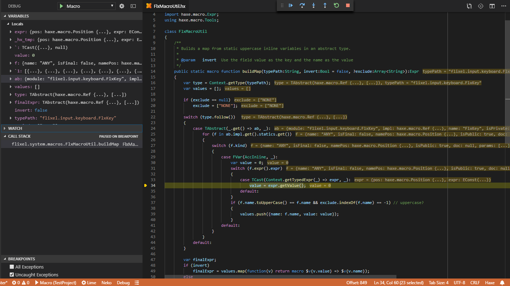

A wide variety of Haxe targets can be debugged with Haxe sources in VSCode:

- HashLink, using the [HashLink Debugger](https://marketplace.visualstudio.com/items?itemName=HaxeFoundation.haxe-hl) extension
- HXCPP, using the [HXCPP Debugger](https://marketplace.visualstudio.com/items?itemName=vshaxe.hxcpp-debugger) extension
- Flash, using the [Flash Debugger](https://marketplace.visualstudio.com/items?itemName=vshaxe.haxe-debug) extension
- JavaScript, using the [sourcemaps generated by Haxe](https://haxe.org/manual/debugging-source-map.html) and the built-in [Node debugger](https://code.visualstudio.com/docs/nodejs/nodejs-debugging) or one of the extensions for remote browser debugging ([Chrome](https://marketplace.visualstudio.com/items?itemName=msjsdiag.debugger-for-chrome), [Firefox](https://marketplace.visualstudio.com/items?itemName=hbenl.vscode-firefox-debug), ...)

There's also a debugger for Haxe 4's new macro interpreter called ["Eval"](https://haxe.org/blog/eval/) built directly into vshaxe. This can be used for:
- debugging all the [different kinds](https://haxe.org/manual/macro.html) of macros (build, expression, init)
- debugging programs executed in the interpreter using `--interp` or `--run`



With a minimal `launch.json`, the debugger is started using the `haxe` specified by the [`"haxe.executable"` setting](/vshaxe/vshaxe/wiki/Configuration#haxe-executable) and with the arguments from the currently selected [Haxe Configuration](/vshaxe/vshaxe/wiki/Configuration#display-configurations-and-display-server):

```json
{
	"version": "0.2.0",
	"configurations": [
		{
			"name": "Haxe Interpreter",
			"type": "haxe-eval",
			"request": "launch"
		}
	]
}
```

To override the arguments that are used, you can set `"args"`, for instance `"args": ["build.hxml", "--interp"]`.
