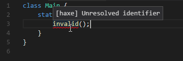
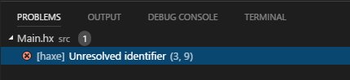
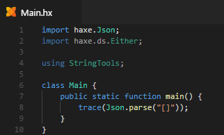
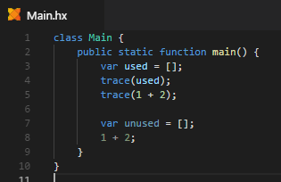
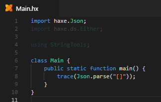

"Diagnostics" are what may be responsible for red or green squiggly lines you may have seen in your code (note that the problem matcher when running a [Task](/vshaxe/vshaxe/wiki/Tasks) can also add these, however).



Like errors during tasks, Diagnostics are also shown in the Problems view:



Diagnostics are incredibly useful since they are updated each time you save, and hence provide real-time feedback over whether your code is valid or not. This way, you can usually tell whether your code will compile, even before actually doing so.

>**Known issues:** simple syntax errors such as missing semicolons are currently not detected by diagnostics ([#102](https://github.com/vshaxe/vshaxe/issues/102)).

Since Diagnostics are updated on save, they combo very well with the `"files.autoSave": "afterDelay"` setting.

You can also run Diagnostics over all files in the current project by using the [Run Global Diagnostics Check](/vshaxe/vshaxe/wiki/Commands#haxe-run-global-diagnostics-check) command.

Diagnostics also fade out unused code, such as the `haxe.ds.Either` import and `StringTools` using in this example:



>**Note**: an import will be reported as "unused" if it is only used in another [Conditional Compilation](https://haxe.org/manual/lf-condition-compilation.html) branch that is not active with the current [Display Configuration](/vshaxe/vshaxe/wiki/Configuration#display-configurations-and-display-server). For instance, the imported type might only be used within an `#if cpp` - block, but you're currently targeting JavaScript. In this case, the import(s) should be wrapped in `#if cpp` as well to avoid the warning.

Another example are unused local variables and expressions whose values are not used for anything:



Many Diagnostics have one or multiple Code Actions associated with them. A comprehensive list of the Code Actions that are available can be found [here](/vshaxe/vshaxe/wiki/Code-Actions).

### Configuration

There are several settings that influence the behavior of Diagnostics:

- `"haxe.enableDiagnostics"` - Controls whether Diagnostics should be shown at all. Defaults to `true`.
- `"workbench.colorCustomizations"` - Lets you configure the appearance of unused code, e.g. to fade it out more strongly:

  ```json
  "workbench.colorCustomizations": {
      "editorUnnecessaryCode.opacity": "#00000030"
  }
  ```

  

- `"haxe.diagnosticsPathFilter"` - A regex that is matched against file paths. Diagnostics for files not matching the filter are hidden.

  The default filter is `"${workspaceRoot}"`, which means Diagnostics are only shown for files in the current workspace (`${workspaceRoot}` is replaced with the current workspace's path). This means that Diagnostics won't be shown for files in your Haxelib directory. If you want to see Diagnostics for Haxelibs as well (for instance if you are the author of a Haxelib), you can effectively disable the filter by making it match everything (`".*?"`).

  For some projects, it makes sense to restrict the filter even further than `"${workspaceRoot}"`, e.g. to `"${workspaceRoot}/Source"` in OpenFL projects. Lime generates some `.hx` files into the `Export` directory, for which Diagnostics are not very useful.

  Apart from `${workspaceRoot}`, there's also a second variable available in filters: `${haxelibPath}`. You could use this to show Diagnostics only for the current workspace and a specific haxelib, for instance:

  ```regex
  (${workspaceRoot}|${haxelibPath}/compiletime)
  ```