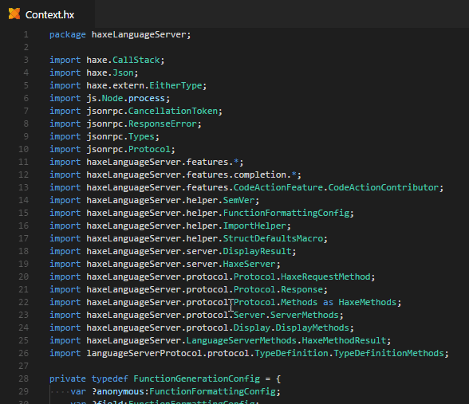
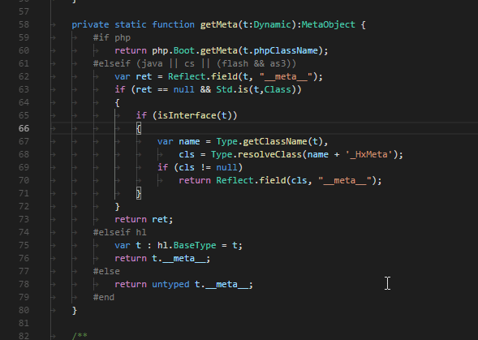
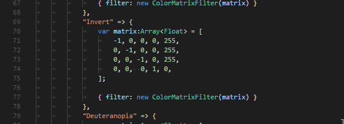
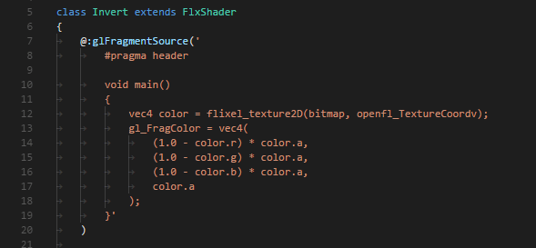

> **Note:** the features on this page will become available with the next version of vshaxe (2.3.0).

VSCode has some basic, indentation-based folding that works for all languages built-in (so you can fold `{}` blocks etc). The Haxe extension however provides a custom folding implementation that better understands Haxe syntax, adding the following features:

### Import Folding

The imports / usings section in a module can be collapsed:

### Conditional Compilation Folding

There are folding markers for `#if`, `#else` and `#elseif`, so conditional compilation blocks can be collapsed:

### Multi-Line String and Array Literal Folding

Multi-line string and array literals can be folded as well:

