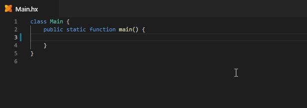
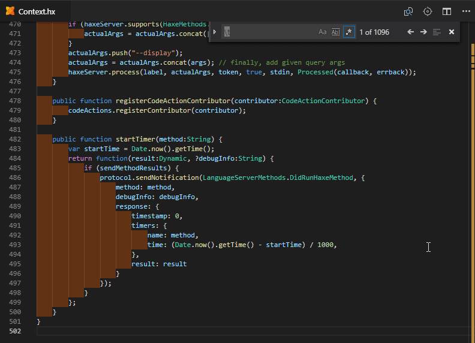
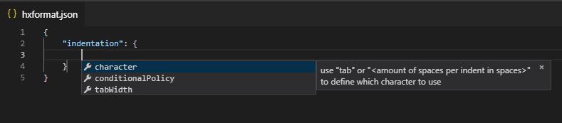

The Haxe extension has built-in code formatting support using [haxe-formatter](https://github.com/HaxeCheckstyle/haxe-formatter). There's two ways to trigger formatting:

- Run the `Format Document` command (<kbd>Shift</kbd>+<kbd>Alt</kbd>+<kbd>F</kbd>).
- Enable "format on save" for formatting to be applied automatically whenever you save a document. This makes for a very convenient workflow where you can just type out some code without worrying too much about correct whitespace or indentation, and then have everything formatted nicely on <kbd>Ctrl</kbd>+<kbd>S</kbd>.
  
  You can place the setting in a `[haxe]` block so it only applies to `.hx` files:

  ```json
  "[haxe]": {
      "editor.formatOnSave": true,
      "editor.formatOnPaste": true
  }
  ```



If you ever accidentally find-and-replace all indentation with an empty string, that's also no problem:



### Transition

When you first start using code formatting in a project, you probably want to reformat all files at once instead of having to trigger "format document" on each file individually. This is especially true if you're using a version control system such as Git, in which case you probably want to limit the diff caused by reformatting to a single commit.

To conveniently format entire directories of source files, you can use the command line version of haxe-formatter that's available on Haxelib:

```
haxelib install formatter
haxelib run formatter -s <source-directory>
```

### Configuration

While using haxe-formatter's default code style is encouraged, it's also highly configurable. A source file uses the `hxformat.json` file that is closest to it. Most projects have a consistent style and thus only need one `hxformat.json` in the project root directory (unless they use the default style).

The Haxe extension includes a JSON schema for `hxformat.json`, which enables auto-completion as well as some documentation:



For more details, check out [haxe-formatter's readme](https://github.com/HaxeCheckstyle/haxe-formatter/blob/master/README.md).