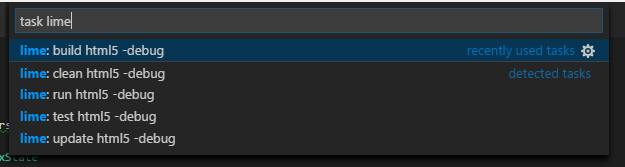

Vshaxe requires a `.hxml` file to invoke the Haxe code completion engine. The method of aquiring this file depends on the framework you are using (unless it's just a pure Haxe project), but for all of them, you need to add the `.hxml` file(s) to your `settings.json` as shown shown below:

```json
{
    "haxe.displayConfigurations": [
        ["completion.hxml"]
    ]
}
```

Here are some notes on how obtain `.hxml` files with popular Haxe frameworks:

### Lime / OpenFL

For Lime and OpenFL projects, there is a dedicated [Lime extension](https://marketplace.visualstudio.com/items?itemName=openfl.lime-vscode-extension) that leverages Vshaxe's extension API to provide completion, meaning you don't have to worry about `.hxml` files. It adds some items to the status bar that allow switching between targets, debug / release etc:


It also generates [tasks]((/vshaxe/vshaxe/wiki/Build-Tasks)) based on the current configuration:



### HaxeFlixel

Flixel supports initializing a `.vscode` workspace via `flixel-tools`, which has the necessary configuration for both completion and debugging. For detailed instructions, please refer to the [official documentation](http://haxeflixel.com/documentation/visual-studio-code/).

### Kha

Like Lime, Kha automatically generates `.hxml` files when building. They are located in `build/project-<platform>.hxml`. 

`settings.json` needs to be adjusted to change the working directory to `build` via `--cwd`:

```json
{
    "haxe.displayConfigurations": [
        ["--cwd", "build", "project-<platform1>.hxml"],
        ["--cwd", "build", "project-<platform2>.hxml"]
    ]
}
```

Problem matcher (`tasks.json` file) also needs to take location of `.hxml` file into account:

```js
"problemMatcher": {
    "fileLocation": ["relative", "${workspaceRoot}/build"],
    // [...]
}
```

### Snow

For Snow, a `.hxml` file can be obtained by running the following command:

```
haxelib run flow info --hxml > completion.hxml
```

### Flambe

For Flambe, a `.hxml` file can be obtained by running the following command:

```
flambe haxe-flags > completion.hxml
```

_____________________

Feel free to file an issue with details for other frameworks. Smoother integration with third-party libraries is planned ([#18](https://github.com/vshaxe/vshaxe/issues/18)).