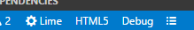

While a pure Haxe project using `.hxml` files works with vshaxe's code completion out of the box, many Haxe frameworks come with custom build tools and project formats. This requires additional setup, here's an overview for some of the most popular framework choices:

### Lime / OpenFL

For Lime and OpenFL projects, there is a dedicated [Lime extension](https://marketplace.visualstudio.com/items?itemName=openfl.lime-vscode-extension) that leverages vshaxe's extension API to provide completion. It adds some items to the status bar that allow switching between targets, debug / release etc:



It also generates [tasks](/vshaxe/vshaxe/wiki/Build-Tasks) based on the current configuration:


### HaxeFlixel

For Flixel, the Lime extension should be used as well. Additionally, it supports initializing a `.vscode` workspace via `flixel-tools`, which has some additional configuration (e.g. for debugging) for convenience. For detailed instructions, please refer to the [official documentation](http://haxeflixel.com/documentation/visual-studio-code/).

### Kha

For Kha, there is an [extension pack](https://marketplace.visualstudio.com/items?itemName=kodetech.kha-extension-pack) available on the VSCode marketplace. Similar to the Lime extension, it integrates seamlessly with vshaxe's code completion API and provides tasks for compilation.

---

For other frameworks that don't have a dedicated VSCode extension integrating with vshaxe, you need to obtain a `*.hxml` file for code completion to work. You can then add it to the display configurations like this (or simply select it from the status bar if it's located in the project's root directory):

```json
{
    "haxe.displayConfigurations": [
        ["completion.hxml"]
    ]
}
```

### Snow

For Snow, a `.hxml` file can be obtained by running the following command (where `<target>` is the name of a target like `web`):

```
haxelib run flow info <target> --hxml > completion.hxml
```

Also check out the [official Luxe documentation on setting up VSCode](https://luxeengine.com/setup-an-ide/#vscode).

### Flambe

For Flambe, a `.hxml` file can be obtained by running the following command:

```
flambe haxe-flags > completion.hxml
```

_____________________

Feel free to file an issue with details for other frameworks.