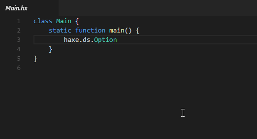
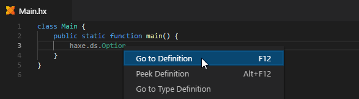
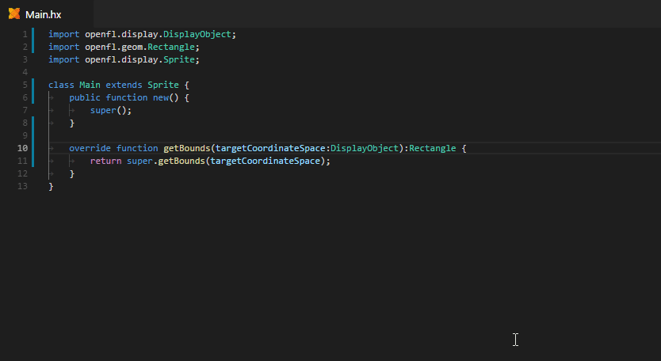

There are three ways to use "Go to Definition" on an identifier:

- Click while holding <kbd>Ctrl</kbd>:

  

- Use the context menu:
  
  

- Press <kbd>F12</kbd>

You can use <kbd>Alt</kbd>+<kbd>◄</kbd> to navigate back to the original file.

> **Tip:** "Go to Definition" can also be used on the `override` keyword of a function to navigate to its parent (requires Haxe 4.0.0-preview.4 or newer).
>
> 