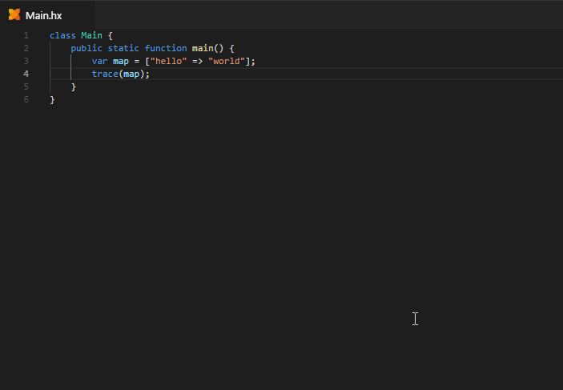

> **Note:** this feature is only available with Haxe versions newer than Haxe 4.0.0-preview.4.

"Go to Type Definition" is similar to [Go to Definition](https://github.com/vshaxe/vshaxe/wiki/Go-to-Definition), but instead of opening the declaration of an identifier itself, it opens the declaration of its _type_:

By default, there is no keyboard shortcut assigned to it.
