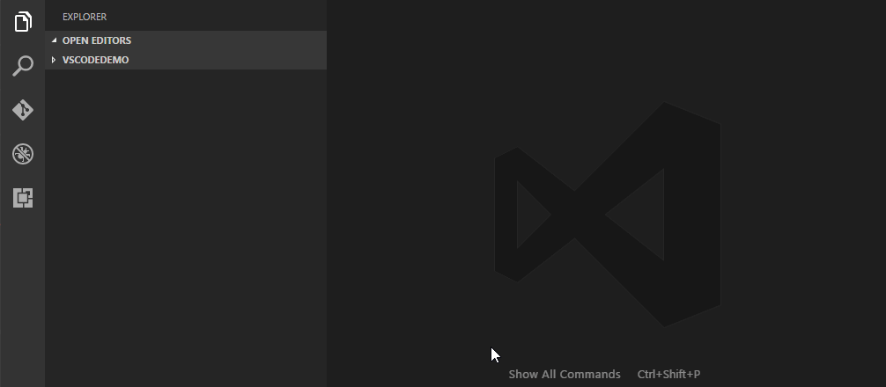
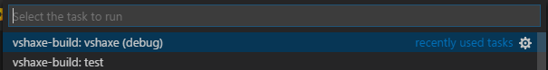

>**IMPORTANT**: vshaxe requires Haxe version 3.4.0 or later (e.g. development) to work. This is due to usage of [`-D display-stdin`](https://github.com/HaxeFoundation/haxe/pull/5120),
[`--wait stdio`](https://github.com/HaxeFoundation/haxe/pull/5188) and tons of other fixes and additions related to IDE support.

### Releases

The easiest way to install the latest vshaxe release is by searching the VSCode marketplace for "Haxe":



Alternatively, press <kbd>Ctrl</kbd>+<kbd>P</kbd> and enter `ext install vshaxe`.

However, instead of installing vshaxe directly, you might want to consider installing the [Haxe Extension Pack](https://marketplace.visualstudio.com/items?itemName=vshaxe.haxe-extension-pack) instead. Apart from vshaxe itself, it also contains the [Haxe Debug](https://marketplace.visualstudio.com/items?itemName=vshaxe.haxe-debug) (for [Flash Debugging](https://github.com/vshaxe/vshaxe/wiki/Flash-Debugging)) and [codedox](https://marketplace.visualstudio.com/items?itemName=wiggin77.codedox) (for doc comment generation) extensions.

### From Source

If you want to contribute to vshaxe, or just prefer working directly from source, you can follow these steps to install vshaxe from GitHub:

1. Navigate to the extensions folder (`C:\Users\<username>\.vscode\extensions` on Windows, `~/.vscode/extensions` otherwise)
2. Remove the existing marketplace installation of vshaxe if present, since it would override the version checked out from source (a folder named `nadako.vshaxe-<version>`).
3. Clone this repo and install the build tool:

    ```
    git clone https://github.com/vshaxe/vshaxe --recursive 
    git clone https://github.com/vshaxe/vshaxe-build
    haxelib dev vshaxe-build vshaxe-build
    ```

4. Change current directory to the cloned one: `cd vshaxe`.
5. To build both client and server in debug mode (as well as install all dependencies):

    ```
    haxelib run vshaxe-build --target vshaxe --debug --mode both
    ```
  
    After initially building _and_ installing the dependencies (with `--mode both`), the usual workflow is to only _rebuild_ vshaxe using the `vshaxe (debug)` [build task](/vshaxe/vshaxe/wiki/Build-Tasks) (<kbd>Ctrl</kbd>+<kbd>Shift</kbd>+<kbd>B</kbd>).

    

6. To test changes to the Haxe Language Server, you can reload it with the [Haxe: Restart language server](/vshaxe/vshaxe/wiki/Commands#haxe-restart-language-server) command.
7. To test chanages to the extension itself, restart VSCode, reload the window or run a debug instance with <kbd>F5</kbd> ([standard vscode workflow](https://code.visualstudio.com/docs/extensions/debugging-extensions)).

Also to be sure to check out the [vshaxe-debug-tools](https://github.com/vshaxe/vshaxe-debug-tools) extension, which includes some tools to aid the development of vshaxe.