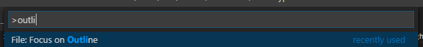
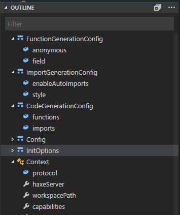
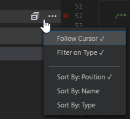
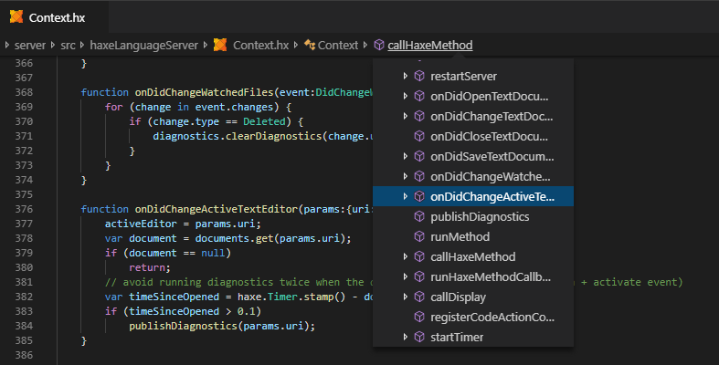

Through [Document Symbols](https://github.com/vshaxe/vshaxe/wiki/Document-Symbols), the Haxe extension also adds support for VSCode's built-in Outline view. It can be opened with the `File: Focus on Outline` command:






With the `Follow Cursor` option, the outline can be configured to automatically highlight the symbol your cursor is located in as you move through the document:



You might also want to consider switching to `Sort By: Position` for symbols to be listed in the same order as they appear in the source file.

______

The same underlying outline data can also be presented in a different way with _Breadcrumbs Navigation_:



You can enable breadcrumbs with the `Toggle Breadcrumbs` command or by adding the following to your settings manually:

```json
"breadcrumbs.enabled": true
```
