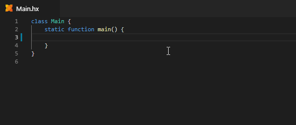
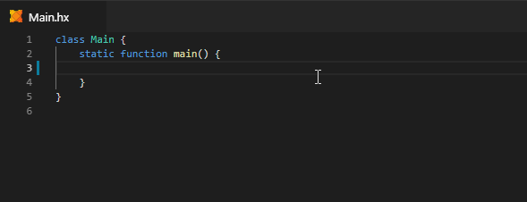
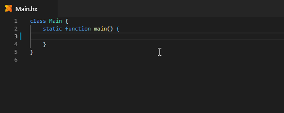
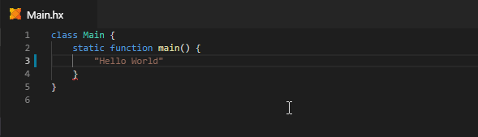
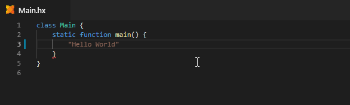
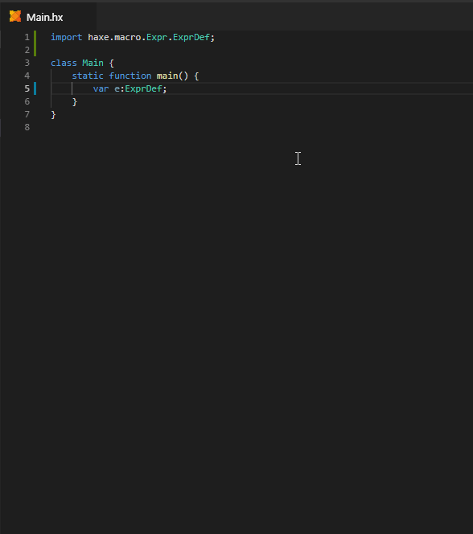

> **Note:** the features on this page all require Haxe 4.0.0-preview.4 or newer.

Postfix completion is triggered when "dot-completing" on identifiers with a certain type.

#### For-Each Loop

If a type has an [Iterator](https://haxe.org/manual/lf-iterators.html), a for loop can be generated for it:



#### Indexed For Loop

Indexed for loop generation is available on integers or types with fields named `length` / `count` / `size`:



#### For Key => Value

For any type that has a `keyValueIterator()`, such as `haxe.ds.Map` and `haxe.ds.List`, you can generate a `key => value` loop:



#### Var



#### Final



#### Switch-Case

For enums or enum abstracts, Postfix Completion allows generating a complete `switch` expression:



### Configuration

- `"haxe.postfixCompletion"` can be used to hide some or all postfix completion items:

	```json
	"haxe.postfixCompletion": {
		"level": "filtered"
	}
	```