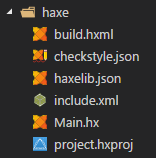
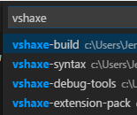
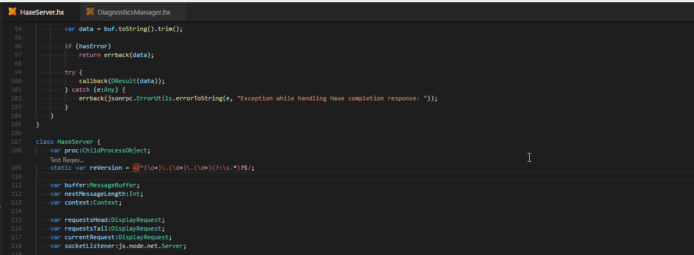
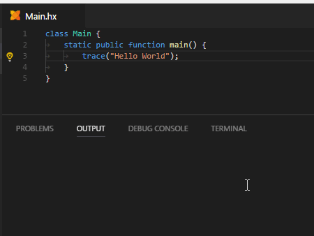

Beyond vshaxe itself (and the other extensions included in our [Haxe Extension Pack](https://marketplace.visualstudio.com/items?itemName=vshaxe.haxe-extension-pack)), there are a plethora of third-party VSCode extensions that will enhance your workflow. Here are some of our personal favorites:

### vscode-icons

The popular [vscode-icons](https://marketplace.visualstudio.com/items?itemName=robertohuertasm.vscode-icons) icon theme supports a number of file formats that are common in the Haxe world:

### Project Manager

Despite not having any Haxe-specific features, [Project Manager](https://marketplace.visualstudio.com/items?itemName=alefragnani.project-manager) is an invaluable tool when working on many different projects (especially in the absence of [official support for opening multiple projects in one window](https://github.com/Microsoft/vscode/issues/396)), as it allows you to quickly switch between them:

It can even auto-generate a list of projects for you by looking for `.git` directories in specific paths.

### Regex Previewer

[Regex Previewer](https://marketplace.visualstudio.com/items?itemName=chrmarti.regex) is perfect if you find yourself using a lot of regex literals (and are constantly switching between VSCode and a tool like [regex101.com](https://regex101.com/)). With this extension, you can test regex literals directly inside of VSCode:

### Code Runner

Code Runner allows you to run the current `.hx` file via a command (using `haxe --run` under the hood). Note: this only works in files with a `main()`:

