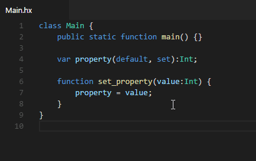

"Rename Symbol" (<kbd>F2</kbd>) allows you to rename variables, fields, function parameters, types or packages. It's smart enough to deal with shadowing or conflicts with existing field names:

"Rename symbol" uses [rename](https://github.com/HaxeCheckstyle/haxe-rename) lib to provide all rename and file move information.

>**Known issues:**
> - you need to save all your files before a rename, otherwise positions will be off and your code might break
> - renaming `package pack.sub;` will prompt you for part of the package name, however it will rename and move your file to whatever you specify in that input field, so always give full new package name
> - rename will only look in folders specified via `haxe.renameSourcFolders` config option (defaults to `["src, "Source", "test", "tests"]`), if you use additional source folders, you need to add them, otherwise they won't be included when renaming

make sure you preview any changes before appling them.