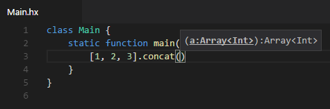
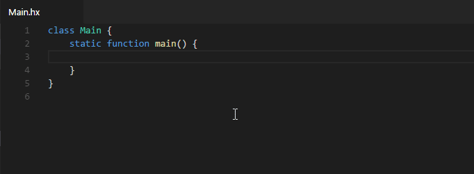
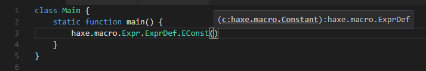
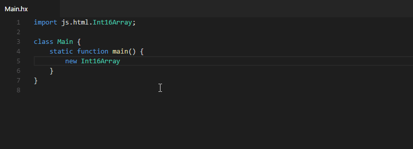

Signature Help is shown whenever the opening `(` of a function call or the `,` after a function argument is typed. It can also be triggered manually with <kbd>Ctrl</kbd>+<kbd>Shift</kbd>+<kbd>Space</kbd>. 

In this example it lets us know that `concat()` expects one argument, and that that argument is of type `Array<Int>`:

If a method has multiple arguments, signature help will underline the current parameter:

Without this, it would sometimes be hard to tell which expression corresponds to which argument in calls with complex arguments.

Signature Help doesn't only work for methods, but also [enum constructors that have arguments](https://haxe.org/manual/types-enum-constructor.html):

If a method has overloads (only possible with [externs](https://haxe.org/manual/lf-externs.html) in Haxe), you can use the <kbd>▲</kbd> and <kbd>▼</kbd> keys to switch between them:

