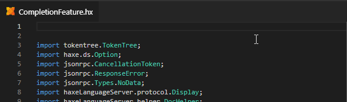
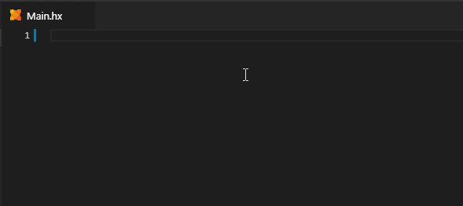
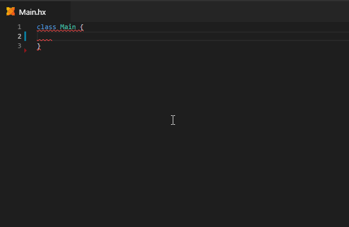

The Haxe extension includes a number of context-sensitive snippets in completion.

### `package`

The `package` statement can be auto-generated with a snippet:

### Types

When requesting completion at type level at a module, snippets for each kind of type (`class`, `interface`, `abstract`, `enum`, `typedef`...) are offered:

### Fields

When requesting completion at field level, a number of handy snippets for generating fields is offered. This ranges from a simple `var` or `function` declaration to a `(get, set)` property complete with its accessor functions:

