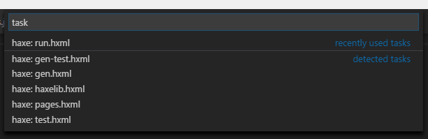
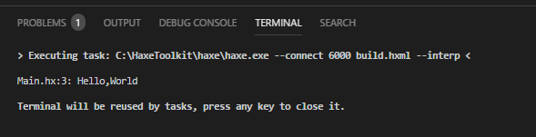
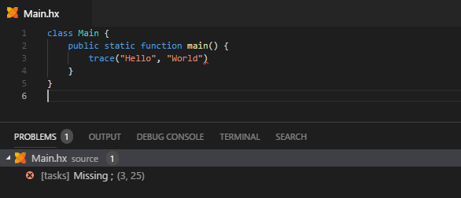

The Haxe extension auto-discovers `.hxml` files in the root directory of your project and generates [Tasks](https://code.visualstudio.com/docs/editor/tasks) for them. You can access them with `Tasks` -> `Run Task...`:



You can configure one of the tasks to be the "default build task" via `Tasks` -> `Configure Default Build Task...`. This creates a `tasks.json` and allows running that task directly with a shortcut (<kbd>Ctrl</kbd>+<kbd>Shift</kbd>+<kbd>B</kbd> by default).

> **Tip:** when configuring a default build task, VSCode inserts a list of `problemMatchers` into your `tasks.json`. Unless you want to customize them, this is redundant and can safely be removed.

> **Tip**: in projects with multiple `.hxml` files / configurations, it usually makes sense to pick `haxe: active configuration` as your default build task. This then lets you conveniently select the configuration to be built [with the `Select Configuration` command or the dropdown menu in the status bar](https://github.com/vshaxe/vshaxe/wiki/Commands#haxe-select-configuration).

Output of tasks is printed to the Terminal:



Compiler errors that occur during a task's execution are picked up by the "Problems" panel. You can click on them to go to the error's position:



### Configuration

- `"haxe.executable"` - Controls which Haxe executable is used to run generated tasks. See [here](https://github.com/vshaxe/vshaxe/wiki/Configuration#haxe-executable) for more information.
- `"haxe.displayPort"` - Allows connecting to the Language Server's Haxe process for faster compilation. The setting defaults to `"auto"`, meaning that for each new instance of VSCode you open, a new unique port will be picked.
- `"haxe.enableCompilationServer"` - Whether generated tasks should connect to the port picked by `"haxe.displayPort"`. Defaults to `true`.
- `"haxe.taskPresentation"` - This lets you control the `presentation` options that [can also be specified in `tasks.json` for individual tasks](https://code.visualstudio.com/docs/editor/tasks#_custom-tasks) _globally_ (for all generated Haxe tasks). For instance, if you want to avoid the Terminal being opened each time you run a task, you can configure it like this:

    ```json
    "haxe.taskPresentation": {
        "reveal": "never"
    }
    ```