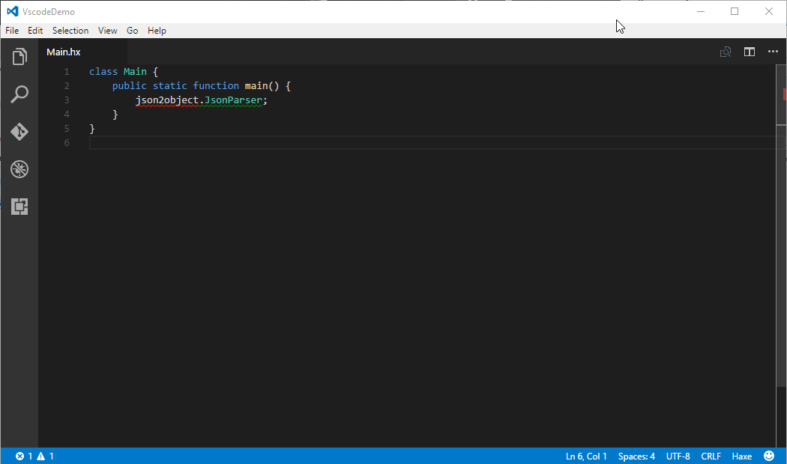
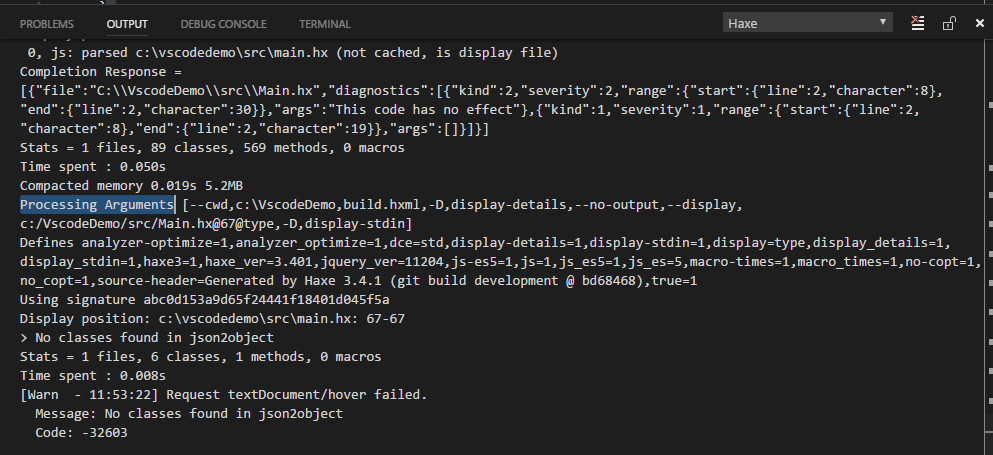
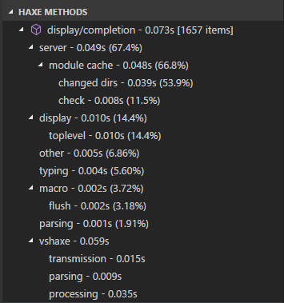

### Completion doesn't work at all

If completion features still aren't working after configuring everything (see [Configurations](/vshaxe/vshaxe/wiki/Configuration#configurations-and-display-server) and [Framework Notes](/vshaxe/vshaxe/wiki/Framework-Notes)), there are some steps you can take to find the culprit.

Output from the Haxe Language Server is logged to the Haxe Output Channel. Here's how to reach it and what it might look like when trying to access a class from a dependency vshaxe doesn't know about (missing `-lib json2object` in the display `.hxml` file):



You can get more verbose output by adding the `-v` flag to the compiler arguments in your `settings.json`:

```json
"haxe.displayServer": {
    "arguments": ["-v"]
}
```

With this, the output channel will show the complete display requests sent to Haxe (as well as the full responses).



If you're unable to solve whatever issues you are having after reading the Setup documentation, don't hesitate to ask a question [on our issue tracker](https://github.com/vshaxe/vshaxe/issues/new).

### Completion is slow

If completion works, but is slower than expected, make sure the [Completion Cache](/vshaxe/vshaxe/wiki/Completion-Cache) is working.

A convenient way to debug slow completion is to use the built-in "Haxe Methods" view (requires Haxe 4.0.0-preview.4 or newer):

```json
"haxe.enableServerView": true
```

This adds a tree view to your explorer with detailed information about what took how much time for a particular method. This is an example of completion working well, with < 100 ms:



If instead, a lot of time was spent in "typing" and / or "macro" and you do have a [Completion Cache](/vshaxe/vshaxe/wiki/Completion-Cache) built up, that is a likely indicator that too many cached files are being invalidated. Add the following to your settings to get a detailed breakdown of the files that are being invalidated for each request in the Haxe Output Channel:

```json
"haxe.displayServer": {
    "arguments": ["-v"],
    "print": {
        "reusing": true
    }
}
```

## server communication recording

Produces a log file that records all communication between vshaxe and Haxe language server

### Configuration

To enable server recording, add `haxe.serverRecording` object to your editor
and/or workspace configuration:

```json
"haxe.serverRecording": {
  "enabled": true,
  "path": ".haxelsp/recording/",
  "watch": [],
  "exclude": [],
  "excludeUntracked": false
}
```

Where:
 * `enabled` should be set to `true` when you want to record
 * `path` is where recording data will be stored, relative to your workspace root
 * `watch` is an array of paths (`String`) to watch for changes during
   recording. Put any (text) resource influencing compilation that is likely to
   change during your coding session in there.
 * `exclude` is currently used to ignore changes in paths:
	 * for `git` diffs (including of untracked files), as a git ignore pattern
	 * for `svn` untracked files, without support for wildcards
 * `excludeUntracked` will ignore untracked (including non-ignored untracked
   files) from diffs stored in the recording.

Changes will apply after you restart your haxe LSP server (on vscode, it should
happen automatically when you save your workspace settings). You should then see
a `.haxelsp/recording/current/` folder with at least a `repro.log` file containing
the recordings.

Each time you restart your LSP server, that `current` directory will be wiped
and replaced with a new recording. You can save current recording **before**
restarting language server if something interesting happened by launching the
`"Haxe: Export current recording"` command via the command palette.

The `current` folder will be copied into `.haxelsp/recording/YYYYMMDD-HHMMSS/`
folder, corresponding to the time of the export. The `current` folder will _not_
be cleared, so you can continue recording if the server is still usable.

**Note:** in other editors, you would have to bind something to the
`haxe/exportServerRecording` LSP request. You can pass an optional config object
to set the export path: `{"dest": "some/path"}`.`
