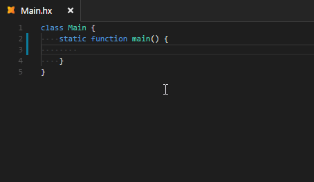

Version 1.0.0 is the biggest release of vshaxe to date. Here's a quick overview of the most interesting new features:

### Code Actions

When referencing a type not yet imported, you can trigger a [Code Action](/vshaxe/vshaxe/wiki/Code-Actions) to do just that.

Alternatively, you may also use "Change to" to use the fully qualified path instead:

On the other hand, if you have _unused_ imports or usings, you can remove them with a single action:

In the same fashion, you can remove code doesn't do anything, like unused variables:

### Completion Cache

When starting up, vshaxe now builds a [Completion Cache](/vshaxe/vshaxe/wiki/Completion-Cache). For projects with large dependencies, this can make a huge difference - for instance, the field completion response time went from ~750 ms to just around 100 ms in an empty Flixel project.

You can see the difference by disabling the completion cache (`"haxe.buildCompletionCache": false`) and restarting vshaxe. Note: add `--times` to your `.hxml` to see the completion times.

### Completion

[Completion](/vshaxe/vshaxe/wiki/Completion) now triggers on `@` to provide completion for compiler metadata:

Similarly, `:` now triggers type hint completion:

And finally, you can get completion for structure fields:

### Workspace Symbols

With <kbd>Ctrl</kbd>+<kbd>T</kbd>, you can now search for [symbols project-wide](/vshaxe/vshaxe/wiki/Workspace-Symbols), including Haxelib dependencies and the standard library.

### Hover Hints

[Hover Hints](/vshaxe/vshaxe/wiki/Hover-Hints) now include documentation and support Markdown formatting. JavaDoc comments are parsed and formatted accordingly.

Hover hints now also work on compiler metadata.

### Code Lens

[Code Lens](/vshaxe/vshaxe/wiki/Code-Lens) tell you how often a field is referenced, how often a function has been overridden, how often an interface has been implemented etc. at one quick glance:

Right now, this feature is opt-in and needs to be enabled with `"haxe.enableCodeLens": true`.