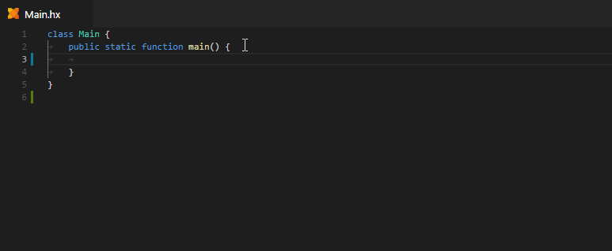

While vshaxe 2.0.0 is completely backwards-compatible with Haxe 3.4.0, you will need to update to [Haxe 4.0.0-preview.4](https://haxe.org/download/version/4.0.0-preview.4/) to take advantage of the latest features. Preview 4 introduces a new JSON-RPC-based protocol for IDE services, which removes many of the previous limitations - and it shows in the features we added!

Technically, this release was meant to be called 2.0.0-preview.1, but the VSCode marketplace doesn't allow that. This means there may still be a few rough edges here and there - any feedback is appreciated!

Here's a quick overview of the changes. For the full changelog, click [here](https://github.com/vshaxe/vshaxe/blob/2.0.0/CHANGELOG.md#200-june-12-2018).

### Auto-Imports

To address the elephant in the room right away - auto-imports, probably the single most requested feature ([and the second ever issue on the repository](https://github.com/vshaxe/vshaxe/issues/2)), are now fully supported:


We didn't stop there though - we also detect when something is _shadowed_ by another identifier and insert the fully qualified path in that case instead:


Similar shadowing checks exist for shadowed fields, where a qualifier like `this` is then auto-inserted.

If you don't like auto-imports, that's ok too - you can just disable them, in which case we will _always_ insert the fully qualified path for unimported types:

```json
"haxe.codeGeneration": {
   "imports": {
       "enableAutoImports": false
   }
}
```

### Presentation

We made some changes to how things are presented in completion item details and hover hints, and added a lot of useful information such as "where is this field from?". This is especially useful in cases where that might not be immediately obvious, like with inheritance or [static extensions](https://haxe.org/manual/lf-static-extension.html):


Contrast this with how completion item details looked with Haxe 3.4.7:


(if you don't see the extended details for completion items, you can press <kbd>Ctrl</kbd>+<kbd>Space</kbd> to toggle between the detailed and compact view)

### Structure Field Completion

Working with structures in Haxe used to involve a lot of manual lookups - "what's this one structure field called again?". No longer!


### Expected Type Completion

Speaking of structures... why not simply let the entire structure be generated for you? You're offered two choices: generate an object literal with all fields, or just the ones that are required / non-optional:

(use <kbd>Ctrl</kbd>+<kbd>Space</kbd> to trigger the completion popup)


Similarly, you can generate an anonymous function whenever a function type is expected:


You can expect more items here in the future, such as generating a field-level or local functions.

There are many ways to customize anonymous function generation, such as generating regular functions instead of Haxe 4 style arrow functions, see the corresponding `"haxe.codeGeneration"` settings:

```json
"haxe.codeGeneration": {
    "functions": {
        "anonymous": {
            "useArrowSyntax": false
        }
    }
}
```

Then again, who doesn't like arrow functions?

### Postfix Completion

Another newly introduced code generation feature is _postfix completion_, which you may already be familiar with from other IDEs / languages. This offers a very convenient way to generate a `switch` expression on enums and enum abstracts:


Imagine having to type all that out by hand! Another great use case for postfix completion is generating different flavors of for loops. You can generate a range-based loop by completing on an `Int` type...


...or a regular `for`-loop by completing on an `Array`:


Postfix `.if`-completion on `Bool` and postfix `.int` completion in `Float` save you a bit less keystrokes than the others, but they still come in handy to avoid having to move the cursor back in some situations. You can expect more postfix completions to be added in the future, and maybe even [a way to define custom postfix completion snippets](https://github.com/vshaxe/vshaxe/issues/231).

### Override Completion

Because expected type and postfix completion wasn't enough, we decided to add even more code generation. You now get "override completion" after the `override` keyword, and selecting a method from there will auto-generate an override for it (complete with imports!):


Speaking of overrides - you can now invoke "Goto Definition" on the `override` keyword to go to the parent method:


### Auto-Insertion and Auto-Triggering

In general, we've identified places where tokens can safely be auto-inserted or where completion can be triggered automatically. We find these improvements make for a much smoother typing experience overall, even if some of them initially take a bit of getting used to. For instance, when selecting a structure field, the `:` is auto-inserted:


When a type has mandatory type parameters, you on longer need to type the `<>` by hand:



You can now press `(` to select a function from code completion, which also auto-inserts the `)` if you haven't changed the `"editor.autoClosingBrackets"` default setting:


Completion now triggers automatically after `extends` or `implements` (and filters the results appropriately):


Selecting an enum constructor after `case` now inserts the required capture variables automatically:


### Performance

>"That's great and all, but.. what about performance?"

...you might ask. Traditionally, performance has been an issue with Haxe-based code completion in vshaxe compared to other IDEs that have their own, internal completion engine such as HaxeDevelop or the IntelliJ plugin - especially for larger projects. There are different factors to consider here:

- Code completion depends on a _cache_ - if building that cache was unsuccessful, completion _will_ be slow. Keep an eye on the Haxe output channel - you can find more details in the [Completion Cache](https://github.com/vshaxe/vshaxe/wiki/Completion-Cache) page. We plan to make errors here more discoverable.
- Some things, such as macros programmed in a certain way, are not "compilation-server-safe" and can cause cascades of cache invalidation. Such issues can cause completion to be slow even if caching was successful beforehand. We have plans to make debugging these sorts of problems easier in the future.

Most importantly, one of the major issues has been addressed with this release:

- Haxe used to check the entire classpath for changed files / directories on certain display requests, which alone can take over 100 ms depending on your project size's. Vshaxe chooses to disable these checks and instead relies on VSCode's built-in file watcher to notify Haxe about which to be invalidated. **We're now at the point where a toplevel completion request in a "fully-cached scenario" in an OpenFL + HaxeFlixel project only takes around 50 ms (rather than 150 ms)!**

Another noteworthy performance improvement is specific to [Workspace Symbols](https://github.com/vshaxe/vshaxe/wiki/Workspace-Symbols) (<kbd>Ctrl</kbd>+<kbd>T</kbd>), which now feels much snappier.

We have also improved the tooling with regards to debugging performance issues - you can opt-into showing the "Haxe Methods" tree view in the explorer to visualizes timers for the various JSON-RPC-based display requests:

```json
"haxe.enableMethodsView": true
```


